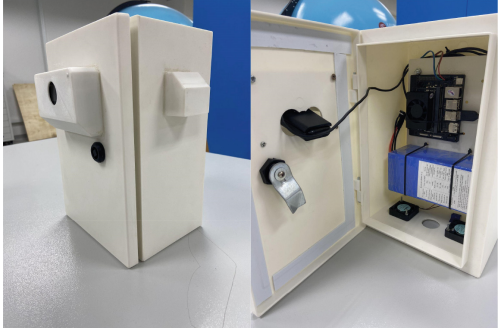
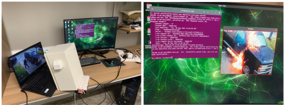

# Benchmarking Jetson Edge Devices with an End-to-end Video-based Anomaly Detection System
This repo contains the Pytorch implementation of our paper:
> [**Benchmarking Jetson Edge Devices with an End-to-end Video-based Anomaly Detection System**](https://link.springer.com/chapter/10.1007/978-3-031-53963-3_25)
>
> Hoang V Pham, Thinh G Tran, Chuong D Le, An D Le, Hien B Vo

- **Accepted at FICC 2024.**
- **Acknowledgment:** Grateful for Mr. Dat Thanh Vo, from University of Windsor, Canada, for the support on the process of designing a 3D cover box. Grateful for Mr. Anh Duy Pham, from Hochschule Bonn-Rhein-Sieg Sankt Augustin, Germany for the constructive comments during the deployment process.

This repository showcases an end-to-end video-based anomaly detection that is capable of running in 🔥 ***real-time*** 🔥 on [NVIDIA Jetson Orin Platforms](https://store.nvidia.com/en-us/jetson/store) with [NVIDIA TensorRT](https://developer.nvidia.com/tensorrt). This repository is built based on [RTFM](https://github.com/tianyu0207/RTFM) as the anomaly detector model and [SlowFast](https://github.com/facebookresearch/SlowFast) as for the end-to-end codebase from camera (and video) directly.

<a id="examples"></a>
## 🤸 Examples

### Example - Detect a video labeled as "arson" from UCF-Crime testset

<div style="text-align: center;">
  
  
</div>

<div style="text-align: center;">
  
</div>

The input is a random video labeled as "arson" from UCF-Crime testset. The input path is specified in the config file.

<a id="prerequisites"></a>
## 🛠️ Prerequisites

**Please download the Resnet50 I3D features extractor and RTFM models checkpoints training on UCF-Crime dataset from links below and save the `ckpt` folder in the current repository:**

> [**I3D non-local pretrain feature extractor**](https://drive.google.com/file/d/1ftpFkny4twWUo1VsDkMR7gn1lv-wAVnI/view?usp=sharing)
> 
> [**RTFM training on UCF-Crime dataset**](https://drive.google.com/file/d/1_UM9Cwiga9iJP5jZRnfW-5pA36hiC33x/view?usp=sharing)

Please download videos data from [HERE](https://drive.google.com/drive/folders/1a05sTLHK4qG0zoqn7m97QKOhauVYVdU0?usp=sharing) & save in `data` folder for testing

<a id="performance"></a>
## ⏱️ Performance

End-to-end system evaluation on multiple Jetson Edge devices

<table style="border-top: solid 1px; border-left: solid 1px; border-right: solid 1px; border-bottom: solid 1px">
    <thead>
        <tr>
            <th rowspan=2 style="text-align: center; border-right: solid 1px"></th>
            <th colspan=2 style="text-align: center; border-right: solid 1px">Jeson Nano (4GB)</th>
            <th colspan=2 style="text-align: center; border-right: solid 1px">Jetson AGX Xavier (32GB)</th>
            <th colspan=2 style="text-align: center; border-right: solid 1px">Jetson Orin Nano (8GB)</th>
        </tr>
        <tr>
            <th style="text-align: center; border-right: solid 1px">Without Torch-TensorRT</th>
            <th style="text-align: center; border-right: solid 1px">Torch-TensorRT</th>
            <th style="text-align: center; border-right: solid 1px">Without Torch-TensorRT</th>
            <th style="text-align: center; border-right: solid 1px">Torch-TensorRT</th>
            <th style="text-align: center; border-right: solid 1px">Without Torch-TensorRT</th>
            <th style="text-align: center; border-right: solid 1px">Torch-TensorRT</th>
        </tr>
    </thead>
    <tbody>
        <tr>
            <td style="text-align: center; border-right: solid 1px">RAM usage (GB)</td>
            <td style="text-align: center; border-right: solid 1px">X</td>
            <td style="text-align: center; border-right: solid 1px">2.61</td>
            <td style="text-align: center; border-right: solid 1px">5.72</td>
            <td style="text-align: center; border-right: solid 1px">3.74</td>
            <td style="text-align: center; border-right: solid 1px">4.94</td>
            <td style="text-align: center; border-right: solid 1px"><strong>3.11</strong></td>
        </tr>
        <tr>
            <td style="text-align: center; border-right: solid 1px">Frame per Second (FPS)</td>
            <td style="text-align: center; border-right: solid 1px">X</td>
            <td style="text-align: center; border-right: solid 1px">1.55</td>
            <td style="text-align: center; border-right: solid 1px">29.57</td>
            <td style="text-align: center; border-right: solid 1px">41.65</td>
            <td style="text-align: center; border-right: solid 1px">36.02</td>
            <td style="text-align: center; border-right: solid 1px"><strong>47.56</strong></td>
        </tr>
    </tbody>
</table>

<details>
<summary>Notes</summary>

In this testing environment, all devices shared the same setup parameters. The system
needs 3.11 GB RAM for active operation, in contrast to the Jetson AGX Xavier’s 3.74 GB consumption, denoting a more RAM-efficient usage. The system is only operational on Jetson Nano with Torch-TensorRT because of the limited RAM resource compared to the required RAM usage from the system. The Jetson Nano with Torch-TensorRT displayed
minimal RAM consumption at 2.61 GB while having the slowest speed, 1.55 FPS only.

Contrastingly, the Jetson Orin Nano proved the fastest speed with 47.56 FPS, amounting to almost 30 times the speed of the Jetson Nano, additionally surpassing the Jetson AGX Xavier by nearly 15% under identical setup conditions. During anomaly detection system operation, the Jetson Orin Nano exhibited half the power consumption compared to Jetson AGX Xavier. As such, the Jetson Orin Nano 8 GB RAM with Torch-TensorRT emerged as the most effective device for anomaly detection system implementation, surpassing the other compared options in terms of efficiency.

</details>

<a id="setup"></a>
## 🛠️ Setup

To get starting with the repository.

1. Install the dependencies

    1. Install conda environment with Python3.10

    2. Install dependencies
        ```bash
        pip install -r requirements.txt
        ```
    3. Install psycopg2
        ```bash
        conda install -c conda-forge psycopg2
        ```
    4. Install detectron2 dependencies
        ```bash
        pip install 'git+https://github.com/facebookresearch/detectron2.git'
        ```
2. Configuration

    All information about system parameters are in configuration file `configs/ucf_RTFM_I3D_slowfast.yaml`, including input & output video path.

3. Run the basic usage example
    
    1. Perform the dection from an input video demo

        ```
        python -m main --cfg configs/ucf_RTFM_I3D_slowfast.yaml
        ```
        > This outputs a result to ``output/[video_input_name].avi``

    2. Perform the dection directly from camera

        In the config file above, please change `WEBCAM` parameter to `-1` and comment the `OUTPUT_FILE` parameter

4. Deploy the repository on Docker (optional)

    Please open `Dockerfile` file to get the deployment script & instruction to begin after deployment on Jetson Orin Nano

    Files `py2trt_i3d.py` and `py2trt_rtfm.py` are used to convert pytorch feature extractor & RTFM models to Torch TensorRT on Jetson Orin Nano

## Citation

If you find this repo useful for your research, please consider citing our paper:

```bibtex
Pham, H.V., Tran, T.G., Le, C.D., Le, A.D., Vo, H.B. (2024). Benchmarking Jetson Edge Devices with an End-to-End Video-Based Anomaly Detection System. In: Arai, K. (eds) Advances in Information and Communication. FICC 2024. Lecture Notes in Networks and Systems, vol 920. Springer, Cham. https://doi.org/10.1007/978-3-031-53963-3_25
```
---
